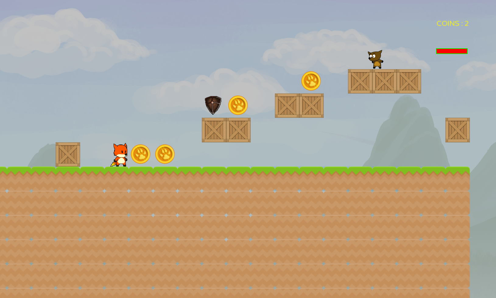
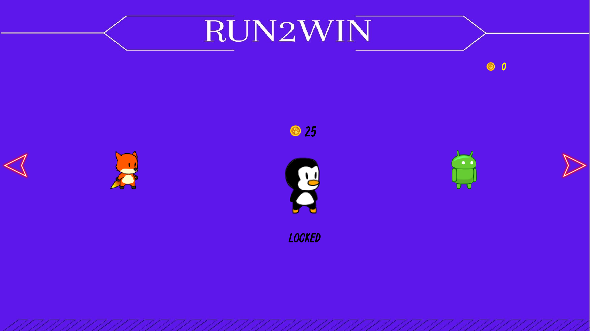

# Run2Win

Run2Win is an engaging and interactive platformer C++ game that features diverse environments, dynamic characters, and challenging obstacles. Designed with fun and interactivity in mind, it provides players with a rich gaming experience complete with power-ups, hostile elements, and customizable game settings. The game is built using the Simple and Fast Multimedia Library (SFML) for graphics and audio, and includes a level design interface that allows players to create and customize their own levels. With multiple characters to choose from, each with unique abilities and unlockable through in-game coins, Run2Win offers a variety of gameplay options to keep players entertained and challenged.

## Features

- **Multiple Characters**: Choose from four unique characters, each unlockable through in-game coins.
- **Interactive Physics**: Experience varying physics across different terrains such as ice, where deceleration is noticeably slower, adding to the challenge and realism.
- **Level Design Interface**: A user-friendly menu system allows players to design and customize levels. Create your own obstacles, enemies, and power-ups to challenge friends and family. 
- **Power-ups and Hazards**: Collect beneficial power-ups like shields and health boosts, or avoid negative ones such as poison. Watch out for enemies, water, and spikes that diminish your health.
- **Sound Effects and Music**: Rich audio effects enhance the gameplay, with adjustable settings to tailor sound levels.
- **Help and Support**: Access the help menu from both the interface and within the game to better understand game mechanics and features.

## Preview




## Requirements
SFML is used for graphics and audio. To install SFML, follow the instructions on the [SFML website](https://www.sfml-dev.org/download.php).

## Installation

To install Run2Win, follow these steps:
1. Clone the repository:
   ```bash
    git clone https://example.com/Run2Win.git 
    ```
2. Navigate to the project directory:
   ```bash
    cd CS1023-Project 
    ```
3. Build the project:
   ```bash
    make game 
    ```
## Usage


To run Run2Win, use the following command:

```bash
./build/Run2Win
```


## Testing

Run2Win includes a suite of automated tests to ensure that every part of the game functions as expected. The tests includes unit tests only.

### Running Tests

To run the tests, follow these steps after setting up the project:

1. Navigate to the project directory if you haven't already:
   ```bash
   cd CS1023-Project
   ```
2. Run the tests:
   ```bash
    make test
    ```
3. View the test results:
   ```bash
    ./build/test
    ```
## Contributors

- [Venkata Datta Sri Harsha Kusampudi](https://github.com/Harsha24112002)
- [Vikas Patnala](https://github.com/VikasPatnala)
- [Sandeep L](https://github.com/Sandeep-L)
- [Revanth B](https://github.com/revanthbadavathu)